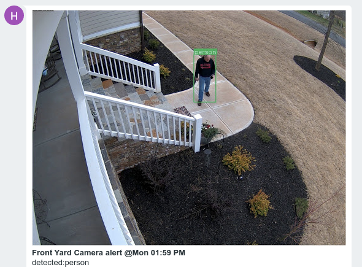

# ZoneMinder Notify App

Appdaemon App to run under Home Assistant's Appdaemon.
This python app is based on foundation work done by 
[@pliablepixels](https://medium.com/zmninja/diy-doorbell-face-recognition-with-zoneminder-and-dbell-e15d4cd261c4) and also a blog titled 
[Sean's Technical Ramblings](https://seanb.co.uk/2019/08/managing-zoneminder-notifications-with-home-assistant/)
 and of course the [Zoneminder Team](https://zoneminder.com/)

This App Registers for state change notification on MQTT sensors
defined in Home Assistant similar to the following:

    sensor:
      - platform: mqtt
        name: "garage alert id"
        state_topic: "zoneminder/1"
        value_template: "{{ value_json.eventid }}"
    
The functioning of these sensors is dependent on proper configuration of Zoneminder and its associated
[EventNotification server](https://zmeventnotification.readthedocs.io/en/latest/). Refer to the 
[Home Assistant Zoneminder Integration page](https://www.home-assistant.io/integrations/zoneminder/)
 for info on integrating Zoneminder.

The name of these sensors are specified in the zmnotify.yaml 
config file. This file is located in the `appdaemon/apps` directory alongside the zmnotify.py file.
These sensors proxy Zoneminder MQTT topics as generated from 
Zoneminder EventNotification Server with the MQTT option enabled. Info 
from the state change data is massaged into a text string and title string intented
send out via a text messages system. The google hangouts text message API is exposed in
Home Assistant. If allowed, zmnotify will pull the image used by Zoneminder's object detection
facility and attach it to the text message.

 
Every Zoneminder event has an integer ID. The image frame is pulled from the Zoneminder 
EventNotification server using the integer event id. Also specified is a frame ID qualifier ('a', 'o',
or integer frame id). Refer to the `zmeventnotification docs` easily located online.

Other notification paths can be specified in the zmnotify associated yaml config file. The authors
use case includes announcing the text on the local google smart speaker if the home is occupied.

**NOTE:** This is a work in progress. Testing is only done with the authors setup. The Zoneminder facility and
Home Assistant are all running in docker containers on the same UNRAID server.

## ZMNotify Configuration
The zmnotify.yaml file provides the configuration parameters
for this app. This file is read by Appdaemon and passed to 
this app via the initialize() method as defined by the Appdaemon
API.

Example zmnotify.yaml

    ZmNotify:
      module: zmnotify
      class: ZmEventNotifier
      zm_url: !secret zm_url
      zmapi_loc: '/api'
      # use token set to true is the recommended setting
      # this allows pyzm to authenticate via token vs user/password, much faster/safer
      zmapi_use_token: true
      zm_user: !secret zm_user
      zm_pw: !secret zm_passwd
      img_width: 1200
      # create the cache dir for locally storing image files pulled from zoneminder
      # this directory is cleaned every 24 hours
      img_cache_dir: '/config/zm'
      # ZM Eventnotification frame type can be 'o', 'a' or a specific frame number
      img_frame_type: 'o'
      # following is a black list of token's to be removed from the zoneminder notification text
      txt_blk_list:
        - Linked
        - Motion
        - 'garage steps'
      # each sensor entry is id'd by the id defined in HA
      # associated with each sensor is a input_boolean defined in HA to allow
      # the user to manually enable/disable the camera-monitor as a sensor
      sensors:
        garage_alert_desc:
          # this is a boolean to allow the HA user to turn off notifications for this camera/sensor
          ha_gate: 'input_boolean.garage_notify'
          # identify the monitor name understood by zoneminder
          # monitors will be disabled (state=None) whenever the ha_gate is set false
          # function indicates what to set the monitor whenever ha_gate goes from false to true
          zm_monitor:
            name: Garage
            function: Modect
          # give permission to this app to control this monitor i.e. set it to None
          # rate limit defines the threshold in number of messages/window (time in seconds)
          # reopen indicates how long to wait before removing the squelch on the monitor events
          zm_control:
            allow: true
            ratelimit:
              window: 300
              cnt: 2
              reopen: 300
        driveway_alert_desc:
          ha_gate: 'input_boolean.driveway_notify'
          zm_monitor:
            name: Driveway
            function: Nodect
          zm_control:
            allow: true
            ratelimit:
              window: 300
              cnt: 2
              reopen: 300
        sidewalk_alert_desc:
          ha_gate: 'input_boolean.front_sidewalk_notify'
          zm_monitor:
            name: 'Front Yard'
            function: Nodect
          zm_control:
            allow: true
            ratelimit:
              window: 300
              cnt: 2
              reopen: 300
      # here is the input_boolean defined in HA to indicate whether the home is
      # occupied or not occupied, this typically will be set in an HA automation
      # but can also be toggled manually to debug zmontify
      occupied: 'input_boolean.home_occupied'
      notify-occupied:
        - !secret notify_tts_mp1
        - !secret notify_tv1
        - !secret notify_hangouts_1
        - !secret notify_hangouts_2
      notify-unoccupied:
        - !secret notify_hangouts_1
        - !secret notify_hangouts_2

Change log:
  - 0.3.1  Stability/bug fixes
  - 0.3.2  Monitor squelch no longer sets monitor function to None
           Add support for different notification paths dependent
           on occupied vs unoccupied.
  - 0.3.3  Add periodic audit to check zoneminder and zmnotify monitor
           are in sync
  - 0.3.4  Add ability to define different notifications based on
           home being occupied or not occupied. Improved README file.